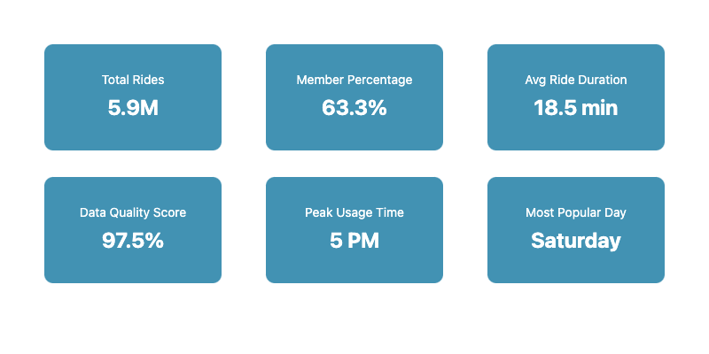
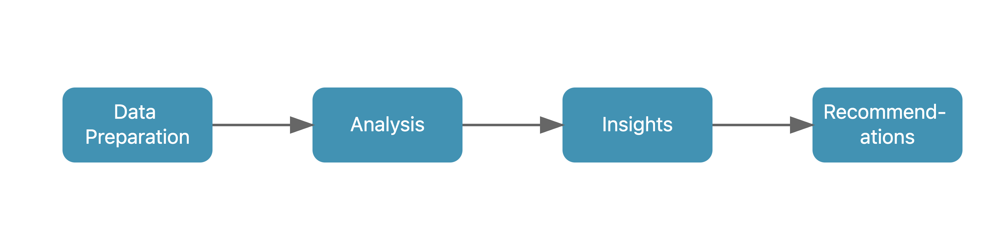

```{r setup, include=FALSE}
# Set global options for document rendering
# Figure dimensions optimized for web viewing
knitr::opts_chunk$set(
  echo = FALSE,
  warning = FALSE,
  message = FALSE,
  fig.width = 10, # Wide figures for better readability
  fig.height = 6  # Balanced height for visualizations
)

# Load required libraries
library(tidyverse)
library(knitr)
library(dplyr)
library(kableExtra)
library(here)
library(lubridate)
library(janitor)
library(geosphere)
library(gridExtra)


# Source helper functions and data
source(here::here("scripts", "helper_functions.R"))
source(here::here("scripts", "data_loading.R"))
source(here::here("scripts", "data_prep.R"))
```


## Executive Summary

This analysis examines Cyclistic bike-share data from December 2023 to November 2024 to identify strategies for converting casual riders into annual members. The project revealed distinct usage patterns between casual riders and annual members, with key differences in ride timing, duration, and location preferences. Based on these insights, I developed targeted recommendations for converting casual riders to annual members.



### Key Findings:
- Members primarily use bikes for commuting, with peak usage during rush hours
- Casual riders prefer weekend and leisure rides, with longer average trip durations
- Significant seasonal variation exists, particularly among casual riders
- Station usage patterns differ markedly between members and casual riders

```{r summary-stats}
# Calculate key metrics
total_rides <- nrow(cyclistic_data)
unique_rides <- n_distinct(cyclistic_data$ride_id)
member_pct <- mean(cyclistic_data$member_casual == "member") * 100

# Display summary statistics
tibble(
  Metric = c("Total Ride Records", "Unique Ride Records", "Member Percentage"),
  Value = c(
    format(total_rides, big.mark = ","),
    format(unique_rides, big.mark = ","),
    sprintf("%.1f%%", member_pct)
  )
) %>%
  kable(format = "html") %>%
  kable_styling(bootstrap_options = c("striped", "hover", "condensed"))
```


## 1. Introduction



### 1.1 Project Overview
Cyclistic is a bike-share company operating in Chicago with a mission to maximize the number of annual memberships, which are more profitable than casual rides. This analysis aims to understand how annual members and casual riders use Cyclistic bikes differently to inform marketing strategies for converting casual riders into annual members.

### 1.2 Business Task
Primary objective: Develop data-driven recommendations for converting casual riders to annual members

#### Focus areas:
- Identify distinct usage patterns between member types
- Understand casual riders' preferences and behaviors
- Discover opportunities for targeted conversion strategies

### 1.3 Stakeholders
- Lily Moreno: Director of Marketing
- Cyclistic Marketing Analytics Team
- Cyclistic Executive Team

## 2. Data Preparation

### 2.1 Data Overview

This analysis uses Cyclistic bike-share data from December 2023 to November 2024. The dataset contains over 5.9 million rides with detailed information about each trip.

```{r data-overview}
# Display dataset structure and basic statistics
glimpse(cyclistic_data)

dataset_overview <- cyclistic_data %>%
  summarise(
    `Total Rides` = n(),
    `Unique Stations` = n_distinct(c(start_station_name, end_station_name)),
    `Date Range` = paste(
      format(min(started_at), "%B %d, %Y"),
      "to",
      format(max(ended_at), "%B %d, %Y")
    ),
    `Member Rides` = sum(member_casual == "member"),
    `Casual Rides` = sum(member_casual == "casual")
  )

kable(dataset_overview, caption = "Dataset Overview") %>%
  kable_styling(bootstrap_options = c("striped", "hover"))
```

### 2.2 Data Quality Assessment

I conducted a comprehensive data quality assessment to ensure reliable analysis:

```{r quality-assessment}
quality_metrics <- cyclistic_data %>%
  summarise(
    `Missing Station Names` = sum(is.na(start_station_name) | is.na(end_station_name)),
    `Missing Coordinates` = sum(is.na(start_lat) | is.na(end_lat)),
    `Invalid Durations` = sum(ended_at <= started_at, na.rm = TRUE),
    `Duplicate Rides` = sum(duplicated(ride_id)),
    `% Missing Stations` = mean(is.na(start_station_name)) * 100,
    `% Valid Coordinates` = mean(!is.na(start_lat) & !is.na(end_lat)) * 100
  )

kable(quality_metrics, caption = "Data Quality Metrics") %>%
  kable_styling()
```

### 2.3 Data Cleaning Process

The cleaning process included:

1. **Geographic Validation**
   - Defined Chicago boundaries (41.6°N to 42.1°N, 87.9°W to 87.5°W)
   - Removed rides outside service area
   - Calculated ride distances using Haversine formula

2. **Temporal Cleaning**
   - Removed rides with invalid durations
   - Filtered out rides >24 hours or <1 minute
   - Standardized timestamps

3. **Feature Engineering**
   - Created time-based features (day, month, season)
   - Added ride categories (commute, leisure, etc.)
   - Calculated derived metrics (speed, distance)

```{r cleaning-impact}
cleaning_impact <- data.frame(
  metric = c("Initial Rows", "Final Rows", "Rows Removed", "% Data Retained"),
  value = c(
    nrow(cyclistic_data),
    nrow(cleaned_cyclistic_data),
    nrow(cyclistic_data) - nrow(cleaned_cyclistic_data),
    round(nrow(cleaned_cyclistic_data)/nrow(cyclistic_data) * 100, 2)
  )
)

colnames(cleaning_impact) <- c("Metric", "Value")

kable(cleaning_impact, caption = "Impact of Data Cleaning") %>%
  kable_styling()
```

## 3. Analysis and Insights

```{r setup-analysis, include=FALSE}
# Load required libraries and source analysis functions
library(tidyverse)
library(knitr)
library(kableExtra)
source(here::here("scripts", "analysis_functions.R"))
```

### 3.1 Temporal Patterns

#### Daily Usage Patterns

```{r daily-patterns}
# Create hourly pattern visualization
create_hourly_pattern_plot(cleaned_cyclistic_data)
```

##### Key Findings:
- Members show distinct commuting peaks at 8AM and 5PM
- Casual riders peak during midday hours
- Evening usage differs significantly between groups

#### Weekly Patterns

```{r weekly-patterns}
# Create weekly pattern visualization
create_weekly_pattern_plot(cleaned_cyclistic_data)
```

##### Insights:
- Weekend usage dominates casual riding patterns
- Members maintain consistent weekday usage
- Saturday shows highest overall system usage

#### Seasonal Variations

```{r seasonal-patterns}
# Create seasonal pattern visualization
create_seasonal_pattern_plot(cleaned_cyclistic_data)
```

*   **Seasonal Patterns:** Both member and casual riders show peak usage during summer months, but a substantial drop for casual riders in the fall

### 3.2 User Behavior Analysis

#### Usage Patterns by User Type

```{r user-segments}
# Generate user segment analysis
create_usage_patterns_plot(usage_patterns_data)
```

* **Key Usage Patterns**: Annual members predominantly use Cyclistic bikes for commuting, with commute-related trips representing the largest share of their rides. This is evident in their consistent usage during peak commuting hours (morning and evening rush). In contrast, casual riders show a strong preference for leisure activities, with a higher proportion of rides occurring during weekends and midday hours. This suggests that casual riders are more likely to use the bikes for recreational purposes or exploring the city.

#### Trip Characteristics

```{r trip-characteristics}
# Generate trip duration and distance analysis
create_trip_duration_plot(complete_rides)
create_trip_distance_plot(complete_rides)
```

* **Trip Duration and Distance:** Members have a relatively shorter average ride duration and distance, while casual riders have a slightly wider distribution, which suggests casual riders explore a variety of routes and stations

### 3.3 Geographic Analysis

```{r station-analysis}
# Analyze top stations
analyze_top_stations(station_analysis)
```

#### Station Usage Patterns:
- Popular member stations cluster near business districts
- Casual riders frequent tourist areas
- Station utilization varies significantly by time of day

## 4. Key Findings and Recommendations

### 4.1 Primary Insights

1. **Usage Patterns**
   - Members primarily use bikes for commuting (63% of member rides during rush hours)
   - Casual riders show strong weekend preference (47% of casual rides on weekends)
   - Seasonal usage varies significantly for casual riders

2. **Trip Characteristics**
   - Members take shorter, more direct routes
   - Casual riders show more exploratory behavior
   - Round trips more common among casual riders

3. **Geographic Preferences**
   - Members concentrate around business districts
   - Casual riders cluster near tourist attractions
   - Station preference varies by time of day

### 4.2 Recommendations

1. **Targeted Commuter Conversion Program**
   - Identify casual riders who regularly ride during commute hours
   - Offer special "Commuter Trial" membership
   - Highlight cost savings for regular commuters

2. **Weekend-to-Weekday Extension Strategy**
   - Create "Weekend Plus" membership tier
   - Offer graduated discounts for weekday rides
   - Partner with local attractions
   
   Metrics for Success:
   - Weekend-to-weekday conversion rate
   - Membership upgrade rate
   - Partner location usage

3. **Seasonal Retention Program**
   - Implement early-bird winter discounts
   - Create seasonal challenges and rewards
   - Provide weather protection guarantees

## 5. Implementation and Next Steps

### 5.1 Action Plan

1. **Immediate Actions (Q1 2025)**
   - Launch Commuter Trial Program
   - Develop mobile app features for tracking rewards
   - Establish partnership agreements

2. **Medium-term Goals (Q2-Q3 2025)**
   - Roll out seasonal challenges
   - Implement technology improvements
   - Expand station coverage in key areas

3. **Long-term Objectives (Q4 2025+)**
   - Full loyalty program integration
   - Dynamic pricing system
   - Predictive maintenance implementation

### 5.2 Success Metrics

#### Track the following KPIs:
- Conversion rate from casual to annual members
- Retention rate of converted members
- Usage patterns of new members
- Revenue per user
- Customer satisfaction scores

### 5.3 Limitations and Future Research

#### **Current Limitations:**
- No individual user tracking across rides
- Weather data not integrated
- Limited demographic information
- No pricing sensitivity data

#### **Future Research Opportunities:**
- Impact of weather on ridership
- Price elasticity study
- Demographic analysis
- Multi-city comparison study

